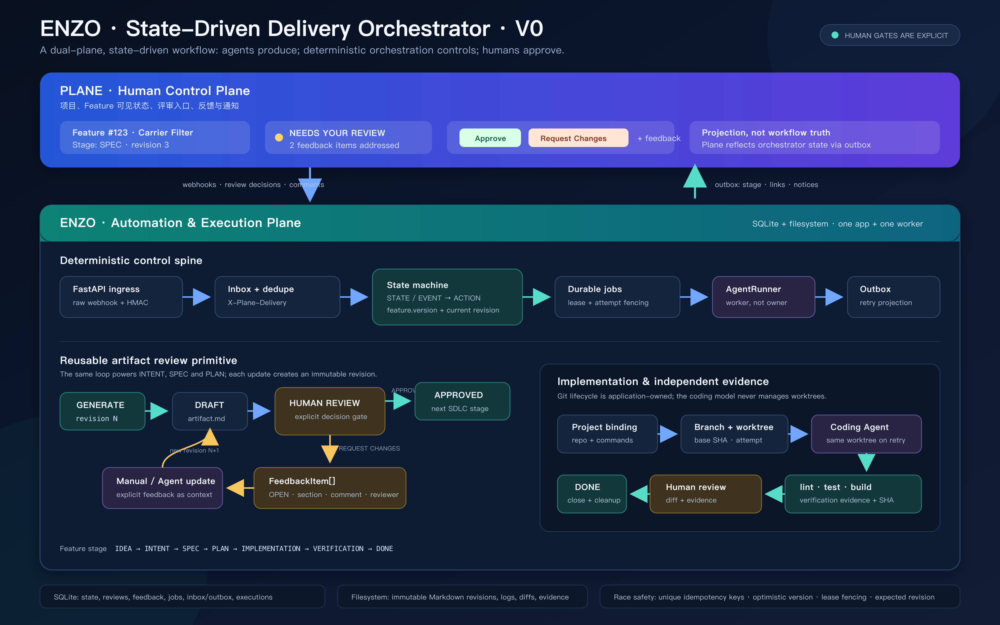

# Enzo V0

Enzo is a state-driven, artifact-first software delivery orchestrator. Plane is
the human-facing control plane; Enzo owns workflow truth, artifact revisions,
agent jobs, idempotency, and approval gates.

> **Experimental:** Enzo is a V0 research prototype, not a production-ready
> service. It intentionally does not provide a generic multi-agent platform or
> replace project-management software. See [SECURITY.md](SECURITY.md) before
> running it outside a local development environment.



The current walking slice is:

```text
Plane work item with enzo:managed
→ signed webhook
→ Generate intent.md with FakeAgent
→ publish NEEDS YOUR REVIEW to Plane
→ request structured changes
→ create first-class FeedbackItems
→ address with FakeAgent or manual revision
→ publish the new immutable revision
→ Approve Intent
→ generate spec.md from the approved Intent
→ run the same review/feedback/revision cycle for Spec
→ Approve Spec
→ generate plan.md plus execution-plan.yaml
→ run the same review/feedback/revision cycle for Plan
→ Approve Plan
→ resolve the Project-level Git repository binding
→ clone/fetch, record base SHA, create branch and isolated worktree
→ run FakeAgent in the worktree
→ run deterministic lint/test/build checks
→ commit and push with application-owned generic Git operations
→ preserve evidence and publish IMPLEMENTATION READY FOR REVIEW
→ request structured implementation changes
→ reuse the same worktree and create a new implementation revision
→ rerun deterministic verification and request review again
→ explicitly approve the implementation
→ verify the remote branch SHA, close the Execution, clean the worktree
→ DONE
```

The opt-in Pi RPC adapter is the first real agent backend; FakeAgent remains the
deterministic default. Explicit Retry/Inspect/Abandon operations and manual
implementation revision signaling remain outside the implemented slice. A
failed execution keeps its worktree and evidence for inspection.

## Design rules

- Enzo is authoritative; Plane is its human-facing projection.
- Feature stage and artifact revision status are independent.
- Intent, Spec, and Plan use one parameterized artifact review primitive;
  adding a stage does not add another hard-coded review implementation.
- Every Plan revision contains both human-readable `plan.md` and validated
  machine-readable `execution-plan.yaml`; its tasks are also normalized into
  SQLite for later deterministic execution.
- Every reviewed artifact revision is immutable on disk.
- Repository configuration belongs to Project; features only reference their Project.
- Agents may edit files inside a supplied worktree but never create branches,
  commit, push, clean up worktrees, or decide whether verification passed.
- Human commands target an exact revision, such as `@enzo approve intent@2`.
- State changes and their durable jobs/outbox messages commit in one SQLite transaction.
- Workers execute agents outside a transaction and compare expected state/version before applying output.
- Plane webhook and outbox retries cannot create duplicate artifacts or comments.

See [ARCHITECTURE_PROPOSAL.md](ARCHITECTURE_PROPOSAL.md) for the wider V0 architecture.

## Quick start

The default setup uses FakePlane and FakeAgent, so it needs no credentials,
Docker, or environment file:

```bash
git clone https://github.com/preservedrdeveloper/enzo-orchestrator.git
cd enzo-orchestrator
python3 -m venv .venv
.venv/bin/pip install '.[dev]'
.venv/bin/enzo
```

Open <http://127.0.0.1:8000/docs>. Create a feature with `POST /fake/features`,
then process its pending work with `POST /worker/drain`. Runtime data goes to
the ignored `var/` directory.

Run the test suite with:

```bash
.venv/bin/pytest
```

Real Plane, Pi, and Git execution are opt-in. Configure them only when needed
using [.env.example](.env.example); the disposable Plane fixture lives in
[dev/README.md](dev/README.md).

## Repository execution

Implementation execution is opt-in. With no `ENZO_REPOSITORY_URL`, Plan
approval leaves the durable `PREPARE_IMPLEMENTATION` job parked and the rest of
the artifact workflow remains usable. To enable execution, configure one
project-level repository URL, default branch, and all three deterministic
commands shown in [.env.example](.env.example).

The execution worker maintains these application-owned paths:

```text
var/repositories/<project>/checkout/   # managed repository cache
var/worktrees/<project>/<execution>/   # retained through human review
var/executions/<execution>/evidence/   # command logs and hashes
```

Repository execution tests use `FakeAgentRunner` to make one deterministic file
change, allowing Git, evidence, stale-result fencing, and failure behavior to be
tested without trusting an LLM. The Pi RPC adapter can be enabled for real agent
runs. Temporary local bare Git remotes are used by the integration tests.

## Agent runners

Enzo routes agent work through `AgentRunnerRouter`; orchestration does not know
about Pi, Codex, Claude, or any provider-specific process protocol. Every
runner advertises a stable name, adapter kind, and capabilities. Every request
contains two independent routing dimensions:

- `role`: the requested behavior (`INTENT`, `SPEC`, `PLAN`, `CODER`, or
  `FEEDBACK_RESOLVER`).
- `workload`: the kind of work (`ARTIFACT_GENERATION`, `ARTIFACT_REVISION`,
  `IMPLEMENTATION`, or `IMPLEMENTATION_REVISION`).

Workload routing wins over role routing, which wins over the default. This is
important because an artifact revision and an implementation revision both use
the `FEEDBACK_RESOLVER` role but require different capabilities. The selected
concrete runner—not the router's Python class name—is persisted with the run.
Requests also carry `project_id`; the routing policy is itself a port, so a
future project-scoped policy can be introduced without changing orchestration
or individual runner adapters.

`fake` is always registered for deterministic tests; real adapters are opt-in.
The routing configuration surface is:

```text
ENZO_AGENT_DEFAULT_RUNNER=fake
ENZO_AGENT_RUNNER_ARTIFACT_GENERATION=fake
ENZO_AGENT_RUNNER_ARTIFACT_REVISION=fake
ENZO_AGENT_RUNNER_IMPLEMENTATION=fake
ENZO_AGENT_RUNNER_IMPLEMENTATION_REVISION=fake
ENZO_AGENT_RUNNER_ROLE_INTENT=fake
```

An unknown runner name or a runner without the required text/workspace
capability fails before invocation. Provider/model identifiers returned by a
real adapter are retained as invocation provenance.

### Pi RPC adapter

`PiAgentRunner` is implemented behind the same boundary and is opt-in. Install
Pi using its official npm package, authenticate it separately, then enable and
route selected workloads:

```bash
npm install -g --ignore-scripts @earendil-works/pi-coding-agent
pi                         # use /login, then exit
```

```text
ENZO_PI_ENABLED=true
ENZO_PI_PROVIDER=deepseek
ENZO_PI_MODEL=deepseek-v4-pro
ENZO_PI_ENV_ALLOWLIST=DEEPSEEK_API_KEY
ENZO_AGENT_RUNNER_ARTIFACT_GENERATION=pi
ENZO_AGENT_RUNNER_ARTIFACT_REVISION=pi
```

The adapter uses ephemeral RPC sessions and strict JSONL. It disables Pi
extensions, skills, prompt templates, context files, and project-local trust.
Artifact work receives no tools. Implementation work receives only
`read,write,edit,grep,find,ls`; `bash` and `powershell` are rejected because
Enzo—not the model—owns commands, Git, verification, and worktree lifecycle.

Enzo also does not forward its full environment into Pi. Provider API-key
variables must be named explicitly in `ENZO_PI_ENV_ALLOWLIST`; subscription
login can use Pi's own auth store. RPC transcripts and stderr are retained
under `var/agent-runs/pi/` by default. Pi itself has no built-in sandbox, so
unattended work on untrusted repositories still needs an OS/container boundary.

## Plane integration

Copy [.env.example](.env.example) to `.env.local`, supply a Plane API token,
webhook secret, reviewer UUID, and optional lifecycle state mapping, then export
those variables before starting Enzo. The local Plane webhook target is:

```text
http://host.docker.internal:8000/webhooks/plane
```

Plane REST calls use `X-Api-Key`. Incoming webhooks require
`X-Plane-Delivery`, `X-Plane-Event`, and a valid `X-Plane-Signature` HMAC over
the exact raw request body. Only work items in the configured project carrying
the `enzo:managed` label enter the pipeline.

## Review commands

### Enzo review surface

Plane remains the inbox and visible feature-stage control plane. Its artifact
links now open Enzo's focused review surface at `/artifacts/<revision-id>`.
That page is a UI adapter over the same deterministic review state machine used
by Plane comments; it does not own a second copy of workflow state.

For a revision in `REVIEW`, a reviewer can select exact Markdown source text,
add multiple draft comments, then submit the complete batch with **Request
changes**. Enzo stores every item independently with a revision-scoped anchor:
the selected text, Unicode code-point offsets, and short prefix/suffix context.
The server verifies that every anchor still matches the immutable revision
before crossing the gate. The reviewer may alternatively approve the revision.

For a revision in `CHANGES_REQUESTED`, the surface offers the two existing
resolution paths:

- **Address with Agent** creates an `UPDATING` child revision and queues the
  configured artifact-revision runner with all unresolved FeedbackItems.
- **Edit manually** saves a new immutable revision and marks the prior open
  feedback as resolved with `MANUAL` provenance.

Review actions include a client request ID and use Enzo's inbox idempotency.
The server still compares the requested revision, current artifact pointer,
feature stage, and feature version in one SQLite write transaction. A duplicate
request is harmless; competing decisions have one winner and one stale result.

The V0 page intentionally uses a small dependency-free browser selection layer.
Its API and anchor model are editor-neutral, so a later Plate editor can replace
the source view without changing orchestration semantics. The page also
feature-detects the proposed WebMCP browser API and, where supported, exposes
one read tool and one review-action tool over the same endpoints.

Implementation review links open a second focused workspace at
`/executions/<execution-id>`. It presents the exact implementation revision,
changed-file summary, full Git patch, per-revision lint/test/build evidence,
runner provenance, structured feedback, and immutable implementation history.
Approve, Request changes, and Address with Agent enter the same implementation
review state machine used by Plane comments. Every browser command targets the
exact visible revision, so concurrent or stale decisions are rejected rather
than applied to a newer commit. An agent revision keeps the same worktree and
the page refreshes automatically while coding and verification run.

The review surface currently has no login flow. In Fake mode it acts as
`ENZO_REVIEW_UI_ACTOR_ID`, or the first configured reviewer when that variable
is unset. In Plane mode, mutations are disabled unless
`ENZO_REVIEW_UI_WRITE_ENABLED=true`. This opt-in is not authentication; keep the
service on a trusted local/test network until authenticated Plane identity
mapping is implemented. Plane-mode writes also require an explicit
`ENZO_REVIEW_UI_ACTOR_ID` present in `ENZO_REVIEWERS`; Enzo never silently
attributes those decisions to an arbitrary reviewer. The HTTP `/worker/drain`
development endpoint is similarly disabled in Plane mode unless
`ENZO_ADMIN_API_ENABLED=true`.

### Plane comment fallback

```text
@enzo approve intent@1

@enzo request-changes intent@1
- [Problem] Explain who is affected.
- [Scope] Exclude administrator reporting.

@enzo address-with-agent intent@1

@enzo approve spec@1

@enzo request-changes spec@1
- [Verification Contract] Add a refresh-persistence E2E assertion.

@enzo approve plan@1

@enzo request-changes implementation@1
- [Behavior] Cover the reviewed edge case.
- [Tests] Add a deterministic assertion.

@enzo address-with-agent implementation@1

@enzo approve implementation@2
```

`/enzo` is also accepted for clients that do not preserve mentions. Normal
comments are ignored. Review commands are accepted only from configured
reviewer IDs and only for the current revision.

## Local integration fixture

The disposable Plane CE stack and its lifecycle commands are documented in
[dev/README.md](dev/README.md). Store local integration credentials in the
ignored `.env.local` and `dev/plane-selfhost/` paths; never add either to
version control.

## Contributing and license

See [CONTRIBUTING.md](CONTRIBUTING.md) for development conventions and the
architecture invariants expected in changes. Enzo is licensed under the
[Apache License 2.0](LICENSE).

Real Plane smoke tests are recorded in:

- [docs/live-plane-smoke-test.md](docs/live-plane-smoke-test.md): the original
  Intent-only walking slice.
- [docs/live-plane-intent-spec-smoke-test.md](docs/live-plane-intent-spec-smoke-test.md):
  the reusable Intent + Spec review cycle through the PLAN boundary.
- [docs/live-plane-plan-smoke-test.md](docs/live-plane-plan-smoke-test.md):
  versioned Plan Markdown plus its machine-readable execution breakdown through
  the IMPLEMENTATION boundary.
- [docs/live-plane-implementation-smoke-test.md](docs/live-plane-implementation-smoke-test.md):
  Project-bound disposable Git execution, verification evidence, push, and the
  implementation review boundary.
